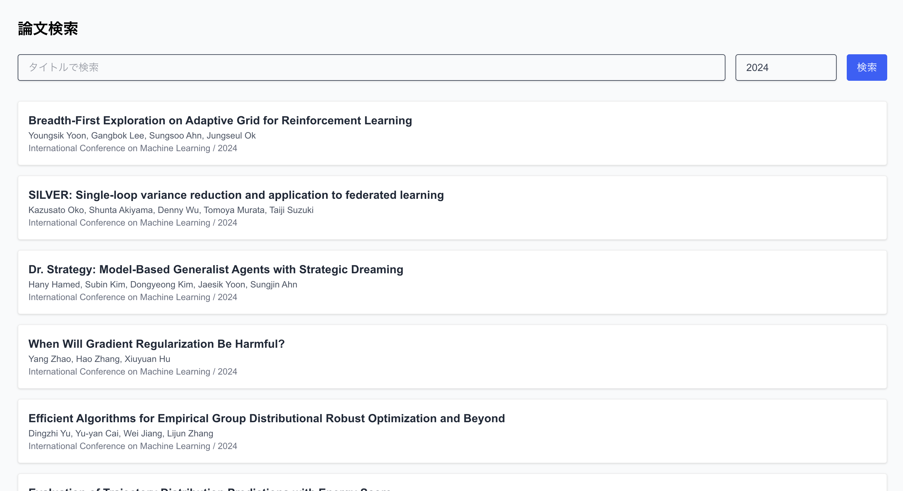
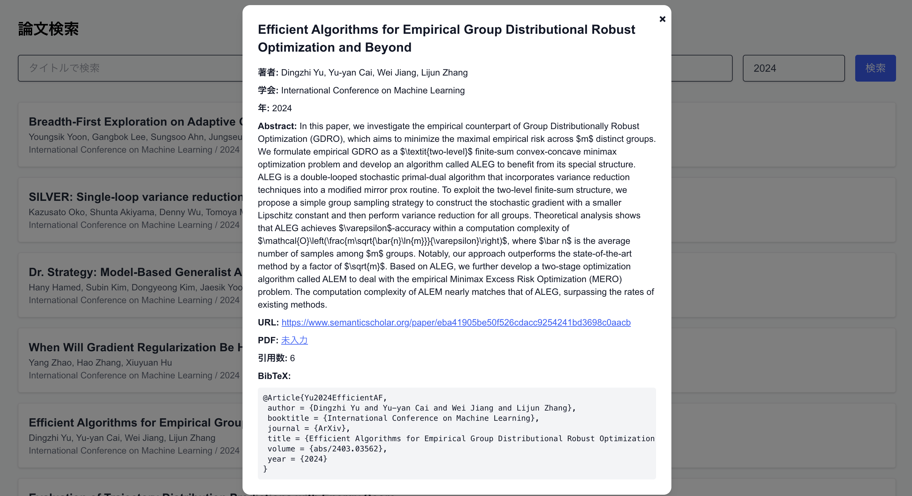

# PaperResearch – 論文情報管理Webアプリ

研究室やチームでの論文管理を効率化するために開発した、Webベースの論文情報管理アプリです。  
論文の基本情報を登録し、Semantic Scholar APIや独自クローラーを用いて詳細情報を自動補完することで、  
情報の一元管理と検索性の向上を実現しています。

---

## 🚀 アプリ概要

| 機能カテゴリ | 内容 |
|--------------|------|
| 📄 論文情報管理 | タイトル・著者・年・学会などの登録・表示 |
| 🔍 論文検索     | タイトル・発表年による絞り込み検索 |
| 🔗 API連携     | Semantic Scholar APIを用いた自動情報補完 |
| 🤖 自動収集     | カスタムクローラにより論文リストを自動取得（例：ICML 2023） |
| 📊 詳細表示     | 論文をクリックするとabstract・BibTeX・PDFリンク等を表示 |
| 🛠 デプロイ     | バックエンド（Go）・フロントエンド（Next.js）ともに本番環境にデプロイ済み |

---

## 🛠 技術スタック

- フロントエンド：Next.js 15 + TypeScript + TailwindCSS（Vercelにて公開）
- バックエンド：Go + Gin + GORM（PostgreSQL連携 / Railwayにて公開）
- データベース：PostgreSQL（GORMでマイグレーション管理）
- 論文API：Semantic Scholar API, Openreview API
- その他：CORS設定、RESTful API設計、ON CONFLICTによるUpsert処理 など

---

## 📸 スクリーンショット




---

## 🔗 デプロイ済みURL

- フロントエンド：[https://paper-research-three.vercel.app/](https://paper-research-three.vercel.app/)
- バックエンドAPI：Railwayにて稼働中（非公開）

---

## 📦 セットアップ手順

### 前提

- Go 1.24+
- Node.js 18+
- PostgreSQL（ローカル or Railway）

### フロントエンド

```bash
cd frontend
npm install
npm run dev
````

### バックエンド

```bash
cd internal
go run cmd/server/main.go
```

※ `.env` にデータベースURL等を記載（`.env.example` あり）

---

## 🧠 開発背景

研究室内の論文管理において、ExcelやCSVベースの情報管理に限界を感じたことをきっかけに開発をスタート。
情報の重複や、検索性・更新性の低さといった課題を、API活用とWeb UIで解決できる仕組みを目指しました。

---

## ✨ アピールポイント

- ✅ GORMのUpsert機能を活用した冪等な論文登録処理
- ✅ Semantic Scholar APIやカスタムクローラによる情報自動取得
- ✅ PostgreSQL + Railwayを用いたクラウドデータベース構築
- ✅ バックエンド・フロントエンドを分離し、それぞれを個別にデプロイ
- ✅ 論文の詳細表示をモーダルで実装、UXを意識した設計

---

## 📚 今後の展望

- ChatGPT APIやLLMを使った要約生成・タグ付け
- BibTeX整形やLaTeX出力
- タグ/キーワードによる論文クラスタリング
